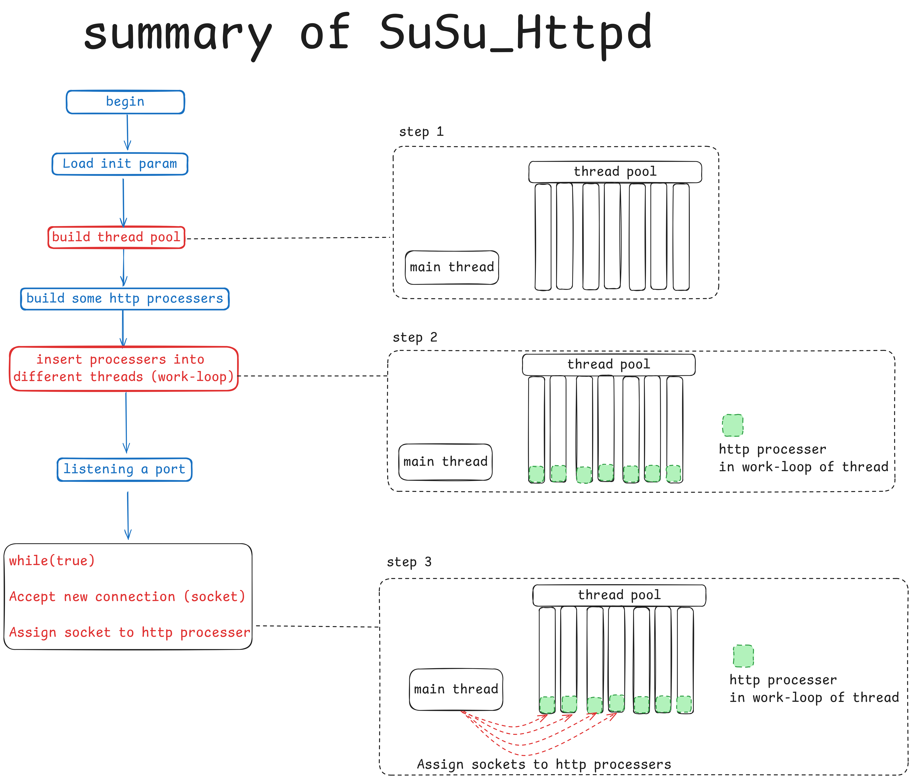
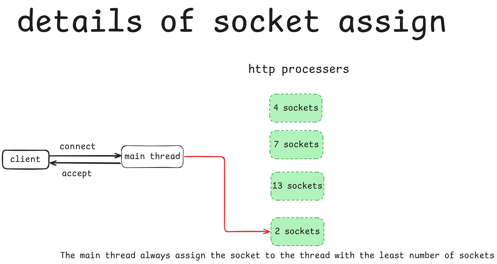
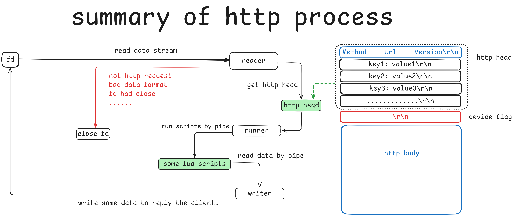

# SuSu-Tools
Some Tiny and useful tools base on c++11.

**Very friendly to beginners**

# Short describe about this project

This project is mainly to pay off "technical debt".

In order to practice my skills, I wrote my own **httpd** after I graduated from school.

But I was too eager for quick success,That makes **the code became extremely confusing**. (Don’t be impatient in coding)

So I have to **refactor** my httpd. 

# The goal of this project

Building a **high-performance http service**. (Maybe also include **https** service)

# Project structure

The project includes the following tools:

[Timer](./SuSu_Timer/README.md): A useful timer.

[Epoll](./SuSu_Epoll/README.md): A tool to listening file describer.

[Init-Param](./SuSu_Init-Param/README.md): A easy way to manager the Init params.

[Thread-Pool](./SuSu_Thread-Pool/README.md): A thread pool supports asynchronous(```#include <future>```).

[Net-Protocol](./SuSu_Net-Protocol/README.md): Some tools in net.

[Cache](./SuSu_Cache/README.md): a cache tool made by template.

[Task-Queue](./SuSu_Task-Queue/README.md): a task queue made by template.

These tools make up the following program:

[Httpd](./SuSu_Httpd/README.md)

## How to compile all the tools?

you can use these code:
```
    make SUSU_TOOLS
```
## How to test all the tools?

you can use these code:
```
    make TEST_ALL
```
Some tests are interactive,the tests will block if no inputs.Some tests cost lot's of times.So maybe use **make TEST_ALL** is not a good idea.

Check Makefile and get more information about test.

# How to use this project

In most of times,you can use susu_tools like this:

```cpp
//add the head file name
#include "susu_timer.hpp"
#include "susu_cache.hpp"

//using the namespace
using namespace susu_tools;

int main()
{
    //some codes
}
```

Different tool has README,read the README can help you how to use SuSu_Tools.

The tests in **./test/** also good example for beginners.

## Httpd
```
sudo apt install lua5.3     # Lua is the default script in susu_httpd,But you can change it to other script.
make HTTPD          # the http service
make RUN-HTTPD            # run the http service
```
Then open **127.0.0.1:9512** in browser to view the default web page.

**9512** is the **default port**, you can change the port to **80** or **8080** in the **config file**.

## the tools
If you wan to **use the tools**, just check the **example folder** or the **test folder**.

# How to make some contribution
[CONTRIBUTING.md](./CONTRIBUTING.md): check here to get more message.


## Road map







road map is made by **excalidraw**.

[click here to get more message](https://excalidraw.com/)